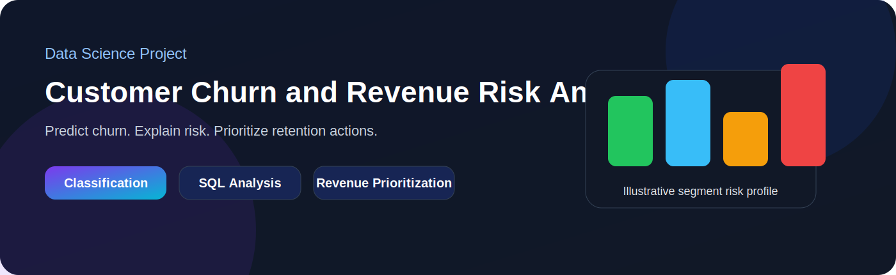
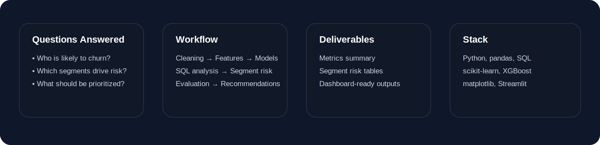
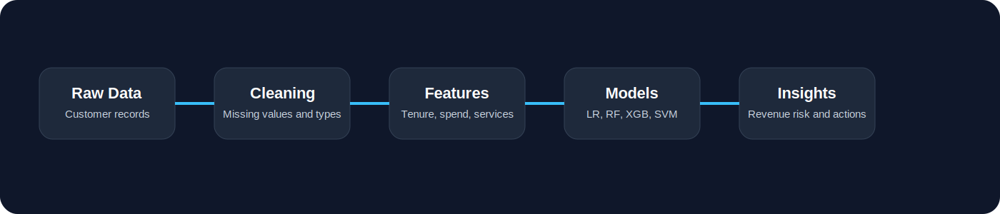
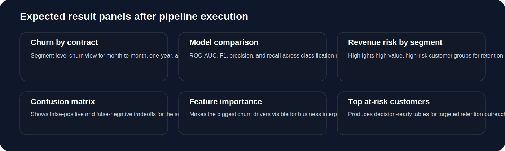
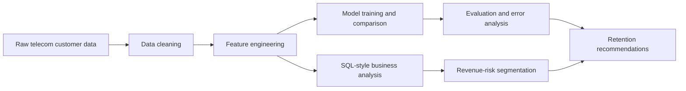

# Customer Churn and Revenue Risk Analytics

<p align="center">
  
</p>

<p align="center">
  
  
  
  
</p>

A data science project that predicts which telecom customers are likely to churn, explains which segments drive the most risk, and turns model output into retention-focused business decisions.

## Project snapshot

<p align="center">
  
</p>

## What this project covers

- customer churn prediction
- revenue-risk prioritization
- SQL-style segment analysis
- feature engineering grounded in business logic
- model comparison and error analysis
- dashboard-ready outputs for decision support

## Visual walkthrough

<p align="center">
  
</p>

<p align="center">
  
</p>

The SVG panels above are lightweight repo graphics so the README stays visually strong before the full pipeline is run. After execution, the actual generated charts are written to `reports/figures/` and can replace or complement these visuals.

## Core questions

1. Which customers are most likely to churn?
2. Which customer groups carry the highest revenue risk?
3. Which business drivers matter most for churn?
4. Which retention actions should be prioritized first?

## Workflow



## Repository layout

```text
customer-churn-revenue-risk-analytics/
├── README.md
├── Makefile
├── requirements.txt
├── data/
│   ├── raw/
│   ├── processed/
│   └── demo/
├── dashboard/
│   └── app.py
├── models/
├── notebooks/
│   └── 01_customer_churn_revenue_risk_analytics.ipynb
├── reports/
│   └── figures/
├── sql/
│   └── churn_revenue_analysis.sql
└── src/
    ├── config.py
    ├── data.py
    ├── features.py
    ├── analysis.py
    ├── modeling.py
    ├── evaluate.py
    └── pipeline.py
```

## Dataset

Recommended dataset:

- **IBM Telco Customer Churn**

Place the CSV in:

```text
data/raw/Telco-Customer-Churn.csv
```

## Quick start

### 1) Install dependencies

```bash
python -m venv .venv
source .venv/bin/activate  # on Windows: .venv\Scripts\activate
pip install -r requirements.txt
```

### 2) Add the dataset

```bash
cp path/to/Telco-Customer-Churn.csv data/raw/Telco-Customer-Churn.csv
```

### 3) Run the pipeline

```bash
python -m src.pipeline --input data/raw/Telco-Customer-Churn.csv --output-dir reports
```

### 4) Launch the dashboard

```bash
streamlit run dashboard/app.py
```

## Output artifacts

After running the pipeline, the repo generates files such as:

- `data/processed/cleaned_telco_churn.csv`
- `reports/metrics_summary.csv`
- `reports/segment_risk_summary.csv`
- `reports/top_revenue_risk_customers.csv`
- `reports/false_positive_cases.csv`
- `reports/false_negative_cases.csv`
- `reports/figures/model_comparison.png`
- `reports/figures/churn_by_contract.png`
- `reports/figures/revenue_risk_by_segment.png`
- `reports/figures/confusion_matrix_best_model.png`
- `reports/figures/feature_importance_top15.png`

## Tech stack

`Python` · `pandas` · `scikit-learn` · `XGBoost` · `matplotlib` · `SQL` · `Streamlit`
