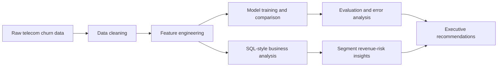
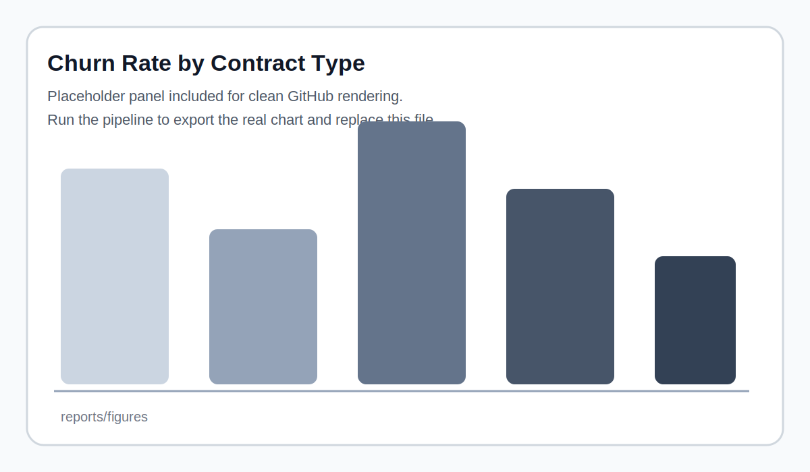
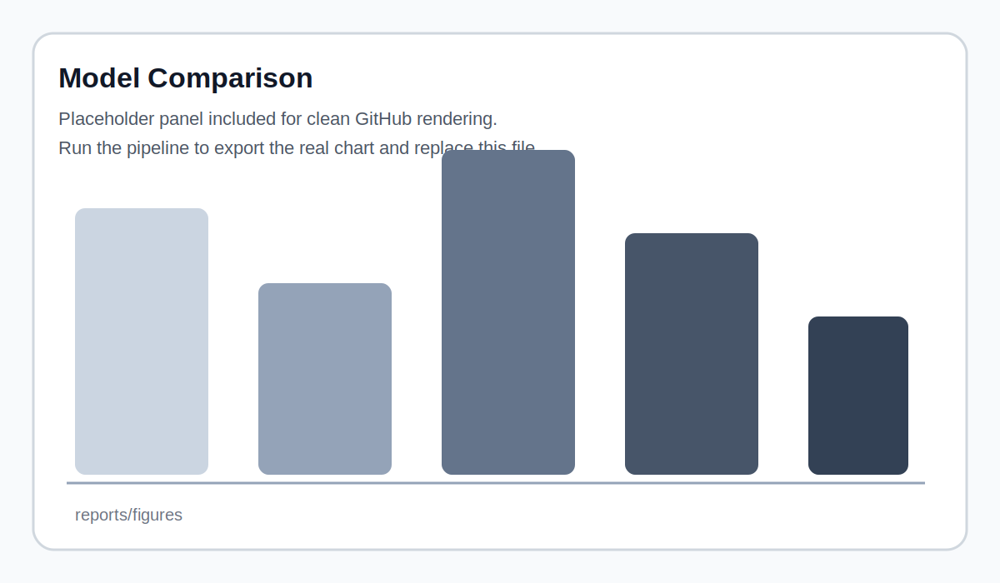

# Customer Churn and Revenue Risk Analytics

End-to-end data science project that predicts **which customers are most likely to churn**, explains **why they are churning**, and estimates **which customer segments carry the highest revenue risk**.

This repo is designed to look and feel like a strong internship-ready GitHub project. It combines **SQL-style business analysis, pandas, feature engineering, classification modeling, error analysis, and decision support** in one reproducible workflow.

## Why this project is strong

This project demonstrates:

- **SQL + pandas** for business analysis and segment-level reporting
- **classification modeling** across multiple algorithms
- **feature engineering** grounded in business logic
- **explainability** through feature importance and segment analysis
- **decision support** by translating model output into retention actions

## Business questions answered

1. **Who is most likely to churn?**
2. **Why are they churning?**
3. **Which customers and segments represent the biggest revenue risk?**
4. **What retention action should be prioritized first?**

## What the project does

- Cleans telecom customer records and handles missing values
- Performs SQL-style churn and revenue analysis by contract type, tenure bucket, payment method, and service mix
- Engineers business-oriented features such as tenure buckets, service count, add-on count, auto-pay flag, estimated annual value, and six-month revenue-at-risk
- Compares Logistic Regression, Random Forest, XGBoost, and SVM
- Evaluates with ROC-AUC, F1, precision, recall, and confusion matrix
- Performs error analysis on false positives and false negatives
- Produces outputs that can feed a dashboard or executive summary

## Tech stack

`Python` · `pandas` · `scikit-learn` · `XGBoost` · `matplotlib` · `SQL` · `Streamlit`

## Project workflow



## Repo structure

```text
customer-churn-revenue-risk-analytics/
├── README.md
├── Makefile
├── requirements.txt
├── data/
│   ├── raw/
│   ├── processed/
│   └── demo/
├── dashboard/
│   └── app.py
├── models/
├── notebooks/
│   └── 01_customer_churn_revenue_risk_analytics.ipynb
├── reports/
│   └── figures/
├── sql/
│   └── churn_revenue_analysis.sql
└── src/
    ├── config.py
    ├── data.py
    ├── features.py
    ├── analysis.py
    ├── modeling.py
    ├── evaluate.py
    └── pipeline.py
```

## Dataset

Recommended dataset:

- **IBM Telco Customer Churn**

Place the CSV in:

```text
data/raw/Telco-Customer-Churn.csv
```

## Quick start

### 1) Create an environment

```bash
python -m venv .venv
source .venv/bin/activate  # on Windows use: .venv\\Scripts\\activate
pip install -r requirements.txt
```

### 2) Add the dataset

```bash
cp path/to/Telco-Customer-Churn.csv data/raw/Telco-Customer-Churn.csv
```

### 3) Run the pipeline

```bash
python -m src.pipeline --input data/raw/Telco-Customer-Churn.csv --output-dir reports
```

### 4) Launch the dashboard

```bash
streamlit run dashboard/app.py
```

## Output artifacts

After running the pipeline, the repo will generate files such as:

- `data/processed/cleaned_telco_churn.csv`
- `reports/metrics_summary.csv`
- `reports/segment_risk_summary.csv`
- `reports/top_revenue_risk_customers.csv`
- `reports/false_positive_cases.csv`
- `reports/false_negative_cases.csv`
- `reports/figures/model_comparison.png`
- `reports/figures/churn_by_contract.png`
- `reports/figures/revenue_risk_by_segment.png`
- `reports/figures/confusion_matrix_best_model.png`
- `reports/figures/feature_importance_top15.png`

## Results section for GitHub

The placeholder figure panels below are included so the README still looks polished before you run the project. Replace them with real generated charts after the first run.

<p align="center">
  
  
</p>
<p align="center">
  
  
</p>
<p align="center">
  
  
</p>

## Example executive findings to write after running the real dataset

- **Highest churn risk**: month-to-month customers with short tenure and electronic check payments
- **Likely drivers**: limited stickiness, missing support-related services, and weak long-term commitment signals
- **Highest revenue risk**: customers with both high monthly charges and high predicted churn probability
- **Priority action**: retain high-value, high-risk customers first instead of broadcasting discounts to the full base

## Example retention actions

- Offer contract upgrade incentives to high-risk month-to-month users
- Promote auto-pay and long-term plans to reduce payment-friction churn
- Prioritize support outreach for high-value customers with weak service stickiness
- Create segment-specific onboarding campaigns for new customers

## Suggested talking points for interviews

- You translated a business problem into a measurable ML workflow
- You compared multiple models instead of relying on a single baseline
- You balanced predictive performance with business interpretability
- You tied model outputs directly to revenue-risk prioritization
- You built a project that is reproducible, explainable, and presentation-ready
